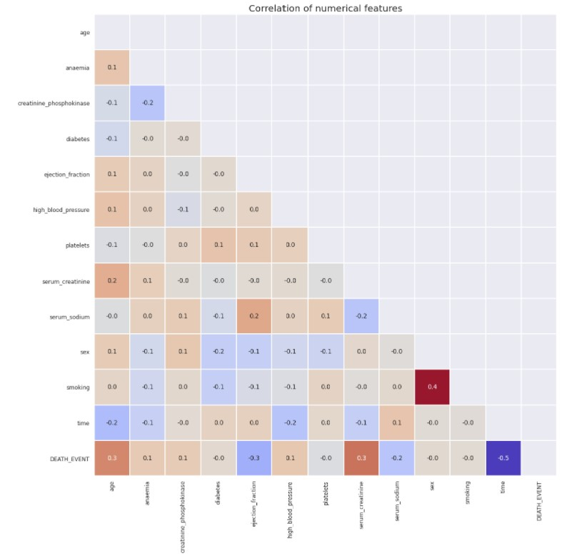
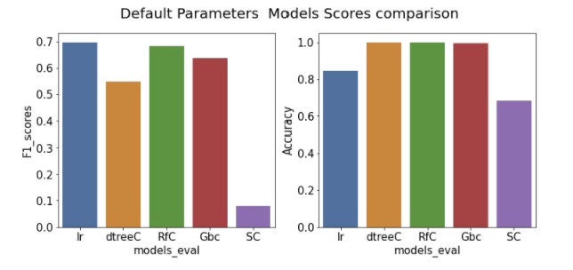
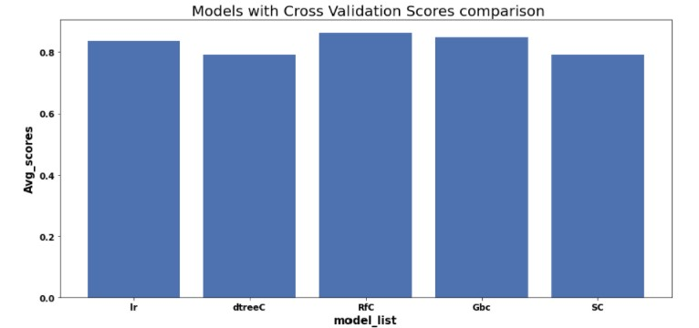
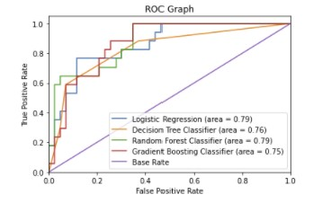

# Heart Failure Prediction Portfolio

  

  

The jupyter notebook in this repo is procedural, it contains explanation of all the steps and respective findings with the use of markdowns. This readme will give a summary of the steps and results of the project. 

Project was split into 2 different notebooks for easy review.

### - Heart Failure Prediction Data Cleaning and EDA Notebook 1 of 2: 
https://github.com/laniyadapo/heartfailureprediction/blob/main/Heart%20Failure%20Prediction%20Data%20Cleaning%20and%20EDA%20Notebook.ipynb

### PROBLEM DEFINITION 
Cardiovascular diseases (CVDs) are the number 1 cause of death globally, taking an estimated 17.9 million lives each year, which accounts for 31% of all deaths worlwide. Heart failure is a common event caused by CVDs and this dataset contains 12 features that can be used to predict mortality by heart failure.

Most cardiovascular diseases can be prevented by addressing behavioural risk factors such as tobacco use, unhealthy diet and obesity, physical inactivity and harmful use of alcohol using population-wide strategies.

People with cardiovascular disease or who are at high cardiovascular risk (due to the presence of one or more risk factors such as hypertension, diabetes, hyperlipidaemia or already established disease) need early detection and management wherein a machine learning model can be of great help.

The goal of this portfolio is create a model for predicting mortality caused by Heart Failure.

#### Supplied Data
- heart_failure_clinical_records_dataset.csv - the training set

#### Deliverables
- Model ready for deployment for predicting mortality by heart failure.

#### Notebook Preparation
- Import Packages
- Define Classes. 
  - Using OOP - Objective Oriented Programming to create classes for functions used in the project.
  - Classes are defined in "codes.py" and "modelcodes.py": (https://github.com/laniyadapo/heartfailureprediction/tree/main/scripts) under "scripts" folder in working directory.

### DATA DISCOVERY 

#### - Obtain data
1. Load Data 
2. Examine and Get Insights on Data
   - The Train data (independent variables + target variable) has 299 rows and 13 columns, 13 numerical features (3 floats and 10 integer).
   - Target Varibale is DEATH_EVENT
   - 6 real numerical values and 6 binary values.
   - No duplicates and null values in data.
3. Explore data
   - Observations from EDA 
     - Hypothesis #1: Older patients should have higher DEATH_EVENTS
       - Confirmed. 30% increase in death event for patients between 70 -95 years old compared to younger patients. There are more patients between 40 - 70yrs old in the data.
     - Hypothesis #2: Anaemic patients should have higher DEATH EVENTS
       - Confirmed. 7% increase in death event for patients with anaemia. There are more patients without anaemia in the data.
     - Hypothesis #3: Diabetic patients should have lower DEATH_EVENTS as it is a treatable ailment.
       - Confirmed. No significant difference in death event between diabetic and non-diabetic patients, there are more non-diabetic patients in the data.
     - Hypothesis #4: High Blood Pressure patients should have higher DEATH EVENTS
       - Confirmed, 8% increase in death event for patients with high blood pressure. There are more patients without high blood pressure in the data.
     - Hypothesis #5: Smokers should have higher DEATH EVENTS
       - Not Confirmed. No significant difference in death event between smokers and non-smokers, there are more non-smokers in the data.
     - Other Observations:
       - No significant difference in death event between male and female patients, there are more male patients in the data.
       - Approx 10% increase in death event for patients with creatinine_phosphokinase between 116 - 582 mcg/L compared to patients with lower or higher values. There are more patients with low creatinine_phosphokinase in the data.
       - Approx 35% increase in death event for patients with Ejection_fraction lower than 30%. The ejection_fraction data is fairly normally distributed.
       - Approx 10% increase in death event for patients with platelets lower than 212,500 kiloplatelets/mL. The platelets data is fairly normally distributed.
       - Approx 30% increase in death event for patients with serum_creatinine higher than 1.4mg/dL. There are more patients with serum_creatinine lower than 0.9mg/dL in the data.
       - Approx 25% increase in death event for patients with serum_sodium lower than 134 mEq/L. The serum_sodium data is fairly normally distributed.
       - Approx 60% increase in death event for patients with time lower than 73.
      
   - Review correlation between each numerical feature and the target variable using plots.Snapshot of produced heatmap below.
     
     

     
     

     
     - Drop features with low correlation to the target variable (DEATH_EVENT)
      
   - Review skewness and distributions of the numerical features and target variable in training data.

### - Heart Failure Prediction Notebook 2 of 2: 
https://github.com/laniyadapo/heartfailureprediction/blob/main/Heart%20Failure%20Prediction%20Model%20Development%20Notebook.ipynb
### MODEL DEVELOPMENT

4. Load and Prepare Data for Modelling
   - Split training data
5. Models Selection
   The DEATH_EVENT prediction expected output is binary value hence we will use from the suite of classification supervised learning algorithms.
   - Using all the remaining features after data cleaning and exploration, create a baseline for all the selected algorithms using the default parameters. Metric used are Confusion Matrix and Accuracy.
   
   

     
   

      
   Model | Metric
   ------------ | -------------
   Logistic Regression | Accuracy: ~0.826667
   Decision Tree Classifier | Accuracy: ~0.760000
   Random Forest Classifier | Accuracy: ~0.826667
   GradientBoost Classifier | Accuracy: ~0.786667
   SupportVector Classifier | Accuracy: ~0.693333
      
   - The next step is to improve the scores and fix any issue of overfitting.
      
- Considering the baseline model predictions are based on data provided without extensive feature generation or model tuning we will perform some feature engineering and cross validation to improve the scores and fix any issue of overfitting before selecting the best model.

6. Feature Importance
   - The top 6 important features are : time, serum_creatinine, ejection_fraction, age, creatinine_phosphokinase & serium_sodium
   - We will drop anaemia and high_blood_pressure as they also have low correlation to the target variable as discovered during the EDA.
7. Feature Engineering on Training data
   - Normalize all numeric feature in preparation for modeling.
   - Split transformed data into train and test data for use during model creation and evaluation process.
8. Hypertuning of models were done using the GridSearch method.
9. Evaluate Models 
   - Each model was evaluated with cross validation technique using optimal parameters derived.
     

  

 

Model | Metric
   ------------ | -------------
   Logistic Regression | Accuracy: ~0.836436
   Decision Tree Classifier | Accuracy: ~0.790780
   Random Forest Classifier | Accuracy: ~0.861879
   GradientBoost Classifier | Accuracy: ~0.849202
   SupportVector Classifier | Accuracy: ~0.790691
10. Explore Ensemble Voting Classifier

11. Evaluate model performance with ROC Curve Plot

  

 

12. Select best model
   - Random Forest Model has the best Area under the curve, hence will be selected as best Model for deployment.
13. Recall and Precision Review from Train Data Predictions

14. Evaluate Model Performance with Threshold selection

There are still 2 False Positive predictions that we can eliminate by further decreasing our threshold. A decision needs to be made on what we will do about the threshold.

Definitely losing a life due to wrong model prediction is unacceptable.
